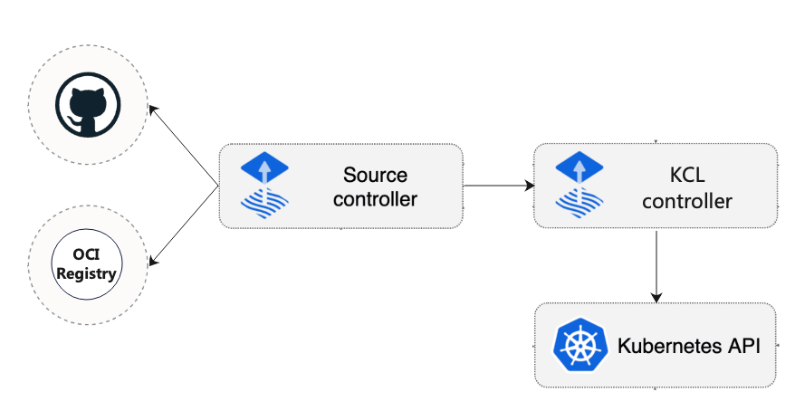

# kcl-controller

kcl-controller 是一个组件，用于集成 [KCL](https://github.com/kcl-lang/kcl) 和 [Flux](https://github.com/fluxcd/flux2), 主要用来根据存储在 git/oci 仓库中的 KCL 程序定义的基础设施和工作负载，通过 [source-controller](https://github.com/fluxcd/source-controller) 获取 KCL 程序，实现基础设施和工作负载的持续交付。



# 特性

- 定期监控存储 KCL 程序的 git 仓库，并根据 git 仓库中的变化，调谐 k8s 集群状态。

# 快速开始

## 前提条件

- k3d: 用于创建测试用的 k8s 集群，如果你已经有了 k8s 集群，可以忽略这一步。
- Kustomize
- Kubectl

## 创建测试用的 k8s 集群

使用`mycluster.yaml`创建集群：

```yaml
apiVersion: k3d.io/v1alpha2
kind: Simple
name: mycluster
servers: 1
agents: 2
```
通过如下命令创建集群：

```shell
k3d cluster create -c mycluster.yaml
```

## 下载 kcl-controller 并且安装到集群中

clone 本仓库到本地：

```shell
git clone https://github.com/kcl-lang/kcl-controller.git
```

进入到本仓库的根目录：

```shell
cd kcl-controller
```

将 kcl-controller 安装到集群中：

```shell
make deploy
```

## 监控一个 git 仓库

我们以仓库 https://github.com/awesome-kusion/kcl-deployment 为例，该仓库中存储了一个 KCL 程序，该程序定义了一个 Deployment，我们将使用 kcl-controller 来部署该程序。

通过 `gitrepo.yaml` 文件，定义一个 `GitRepository` 对象，用来监控该仓库：

```yaml
apiVersion: source.toolkit.fluxcd.io/v1
kind: GitRepository
metadata:
  name: kcl-deployment
  namespace: default
spec:
  interval: 30s # 每隔 30s 检查一次仓库
  url: https://github.com/awesome-kusion/kcl-deployment.git
  ref:
    branch: main # 监控 main 分支
```

使用命令 `kubectl apply -f gitrepo.yaml` 将该对象部署到集群中。

## 查看部署结果

使用命令 `kubectl get deployment` 查看部署结果：

```shell

```

## 更新仓库中的 KCL 程序

我们可以通过修改仓库中的 KCL 程序，来更新集群中的 Deployment。

修改仓库中的 KCL 程序，将 nginx 的版本从 `1.7.7` 修改为 `1.7.8`，将`deployment`的名字改为 `nginx-deployment-1`，并且提交到 main 分支。

具体变化可以参考:
[nginx:1.7.7 deployment]() -> [nginx:1.7.8 deployment]()

# 未来工作

- 添加 KCL OCI Registry Controller，用于支持存储在 OCI 仓库中的 KCL 程序。
