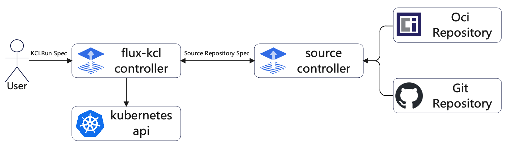

<h1 align="center">KCL controller</h1>

<p align="center">
<a href="./README.md">English</a> | <a href="./README-zh.md">简体中文</a>
</p>

# Introduction

The kcl-controller is a component developed for the integration of [KCL](https://github.com/kcl-lang/kcl) and [Flux](https://github.com/fluxcd/flux2), designed to orchestrate continuous delivery pipelines for infrastructure and workloads defined with KCL based on the [source-controller](https://github.com/fluxcd/source-controller) to acquire the KCL program from repositories.



# Features

- Periodically monitor git repositories that store KCL programs and reconcile k8s cluster status according to changes in git repositories.

# Quick Start

## Prerequisites

- k3d: used to create a k8s cluster for testing, if you already have a k8s cluster, you can skip ignore this.
- Kustomize
- Kubectl

## Create a test k8s cluster

Create a cluster using the following command:

```shell
k3d cluster create
```

## Download kcl-controller and install it into the cluster

Clone this repository to local:

```shell
git clone https://github.com/kcl-lang/flux-kcl-controller.git
```

Enter the root directory of this repository:

```shell
cd flux-kcl-controller
```

Install kcl-controller into the cluster:

```shell
make deploy
```

## Monitor a git repository

Take the github repository https://github.com/awesome-kusion/kcl-deployment as an example. This repository stores a KCL program that defines a `Deployment`. We will use kcl-controller to deploy this program.

Define a `GitRepository` object through the `gitrepo.yaml` file to monitor the repository:

```yaml
apiVersion: source.toolkit.fluxcd.io/v1
kind: GitRepository
metadata:
  name: kcl-deployment
  namespace: source-system
spec:
  interval: 30s
  url: https://github.com/awesome-kusion/kcl-deployment.git
  ref:
    branch: main
---
apiVersion: krm.kcl.dev.fluxcd/v1alpha1
kind: KCLRun
metadata:
  name: kcl-deployment
  namespace: source-system
spec:
  sourceRef:
    kind: GitRepository
    name: kcl-deployment
```

Use the command `kubectl apply -f gitrepo.yaml` to deploy the object to the cluster.

## View the deployment result

Use the command `kubectl get deployment` to view the deployment result:

```shell
NAME               READY   UP-TO-DATE   AVAILABLE   AGE
nginx-deployment   1/1     1            0           28s
```

The `nginx-deployment` is deployed successfully.

## Update the KCL program in the repository

We can update the `Deployment` in the cluster by modifying the KCL program in the repository.

Change the version of nginx from `1.7.7` to `1.7.8` and the name of `deployment` to `nginx-deployment-1`, and commit to the main branch.

The changes can be referred to: [nginx:1.7.7 deployment](https://github.com/awesome-kusion/kcl-deployment/commit/dc8b2aa70b1b47bef0637212ea184792b8c43449) -> [nginx:1.7.8 deployment](https://github.com/awesome-kusion/kcl-deployment/commit/f257a71fdff6cb9190f49c1dbf5fa4496d7b3cb2)

Use the command `kubectl get deployment` to view the deployment result:


```shell
NAME                 READY   UP-TO-DATE   AVAILABLE   AGE
nginx-deployment     1/1     1            1           20m
nginx-deployment-1   1/1     1            0           4s
```

kcl-controller creates a `nginx-deployment-1` according to the KCL program in the repository.

# Roadmap

- Add KCL OCI Registry Controller to support KCL programs stored in OCI registry.
